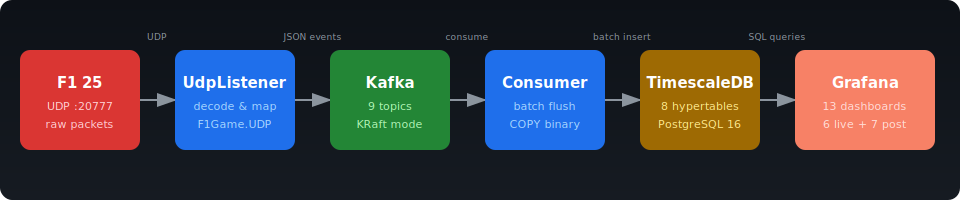
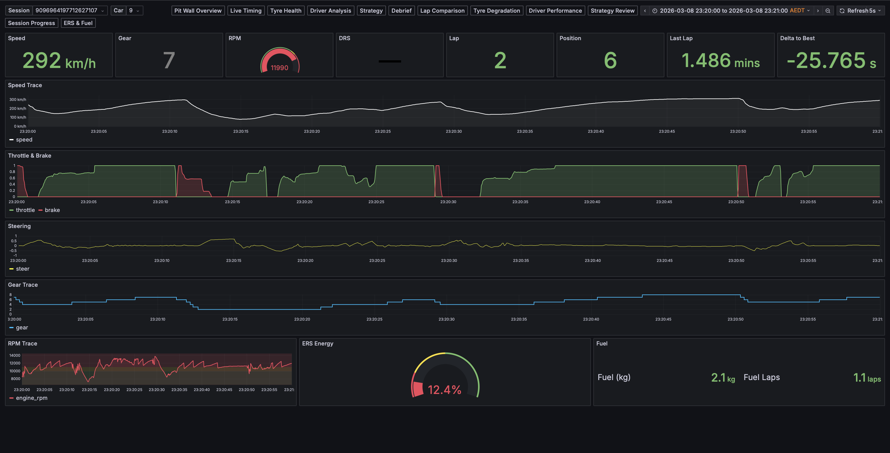
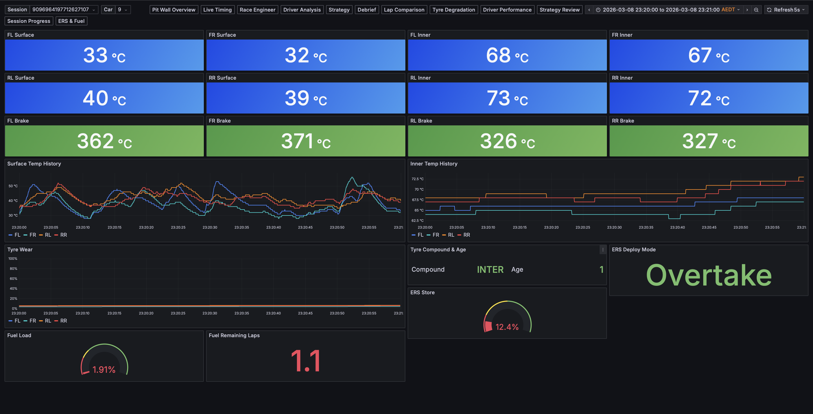
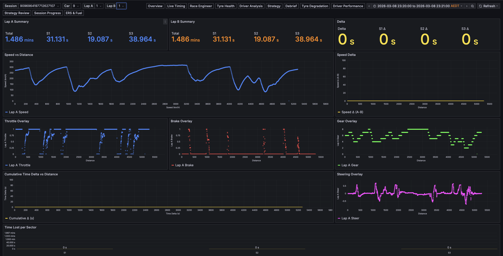

# open-race-telemetry

Open-source, local-first sim racing telemetry pipeline for **EA F1 25**. Captures UDP telemetry from the game, streams it through Kafka into TimescaleDB, and visualises everything in Grafana — all running locally via Docker Compose.

<p align="center">
  
</p>

## Features

- **Real-time telemetry** — speed, throttle, brake, gear, RPM, DRS, tyre temps, G-forces at up to 60 Hz
- **13 Grafana dashboards** — 6 live + 7 post-session analysis views, all pre-provisioned
- **High-throughput ingestion** — Npgsql COPY binary protocol for batch inserts into TimescaleDB
- **Single-car or full-grid** — track just the player or all 20 cars
- **Zero-config local dev** — `docker compose up` and you're running
- **Fully typed pipeline** — F1Game.UDP packet structs mapped to canonical C# records, serialised through Kafka, into typed DB columns

## Screenshots

### Race Engineer — Live Telemetry
Speed, throttle/brake traces, steering, gear shifts, RPM, ERS and fuel — all updating in real time.



### Tyre & Car Health
Four-corner tyre surface/inner temperatures, brake temps, wear, compound info, and ERS deploy mode.



### Lap Comparison — Post-Session
Side-by-side telemetry overlay with speed, throttle, brake, gear, and steering traces plotted against lap distance, plus cumulative time delta and sector breakdown.



## Quick Start

### Prerequisites

- [Docker Desktop](https://www.docker.com/products/docker-desktop/) (or Docker Engine + Compose)
- [.NET 10 SDK](https://dotnet.microsoft.com/download/dotnet/10.0)
- EA F1 25 with UDP telemetry enabled (Settings → Telemetry → UDP, port `20777`)

### 1. Start infrastructure

```bash
cd infra
docker compose up -d
```

This starts Kafka (KRaft), TimescaleDB (PostgreSQL 16), and Grafana with all dashboards pre-provisioned.

### 2. Run the ingester

```bash
dotnet run --project src/TelemetryIngester
```

The service listens on UDP port 20777 and will begin processing telemetry as soon as you start a session in F1 25.

### 3. Open Grafana

Navigate to [http://localhost:3000](http://localhost:3000) — dashboards are ready under the pre-provisioned folder.

## Dashboards

### Live Telemetry

| Dashboard | Description |
|---|---|
| **Pit Wall Overview** | Leader board, session state, weather conditions |
| **Live Timing** | Current lap, position, sector times |
| **Race Engineer** | Speed, throttle, brake, gear, RPM, DRS, tyre temps, G-forces |
| **Tyre & Car Health** | Tyre temperatures, wear, brake temps, fuel level |
| **Driver Analysis** | Throttle/brake inputs vs car outputs |
| **Strategy** | Fuel consumption rate, pit window, tyre age |

### Post-Session Analysis

| Dashboard | Description |
|---|---|
| **Session Debrief** | Lap summary, penalties, pit stop history |
| **Lap Comparison** | Best vs last lap telemetry overlay |
| **Tyre Degradation** | Temperature and wear trends across laps |
| **Driver Performance** | Lap time distribution, consistency metrics |
| **Strategy Retrospective** | Fuel usage, compound history, stint analysis |
| **Session Progress** | Lap-by-lap position changes and pace |
| **ERS & Fuel Review** | ERS deployment modes, MGU harvesting, fuel consumption |

## Architecture

```
src/TelemetryIngester/
├── Services/        # UdpListenerService, KafkaConsumerService
├── Mapping/         # PacketMapper — F1Game.UDP → canonical events
├── Events/          # 10 canonical event records
├── Kafka/           # KafkaProducer, serialisation
├── Storage/         # TimescaleWriter (COPY binary batch inserts)
└── Configuration/   # Strongly-typed IOptions<T> classes

infra/
├── docker-compose.yml
├── timescaledb/init.sql       # 8 hypertables with indexes
└── grafana/
    ├── dashboards/            # 13 pre-provisioned dashboards
    └── provisioning/          # Datasource & dashboard config
```

### Data Flow

1. **UdpListenerService** receives raw UDP packets from F1 25
2. **PacketMapper** decodes via [F1Game.UDP](https://github.com/volodymyr-fed/F1Game.UDP) and maps to canonical event records
3. Events are published to **Kafka** (9 topics, keyed by session UID)
4. **KafkaConsumerService** batches events (100 count / 500ms timeout)
5. **TimescaleWriter** flushes batches to **TimescaleDB** using Npgsql COPY protocol
6. **Grafana** queries TimescaleDB for live and historical visualisation

### Event Types

| Event | Frequency | Key Data |
|---|---|---|
| CarTelemetry | ~60 Hz | Speed, throttle, brake, gear, RPM, DRS, tyre/brake temps |
| LapData | ~60 Hz | Lap time, sectors, position, pit status |
| CarStatus | ~60 Hz | Tyre wear, compound, fuel, ERS |
| CarMotion | ~60 Hz | G-force (lateral, longitudinal, vertical) |
| SessionHistory | ~1/sec | Best lap, sector breakdown |
| Participant | ~1/5sec | Driver name, team, nationality |
| Session | ~2/sec | Track, weather, pit window |
| WeatherForecast | periodic | Forecast samples |
| FinalClassification | end of session | Final standings, points, tyre stints |

## Configuration

All config is in `appsettings.json` / `appsettings.Development.json`:

| Section | Key | Default | Description |
|---|---|---|---|
| `Telemetry` | `ListenPort` | `20777` | UDP port for F1 telemetry |
| `Telemetry` | `AllCars` | `false` | Emit all 20 cars (vs player only) |
| `Kafka` | `BootstrapServers` | `localhost:9092` | Kafka broker address |
| `Kafka` | `GroupId` | `telemetry-ingester` | Consumer group ID |
| `TimescaleDb` | `ConnectionString` | *(dev default set)* | Npgsql connection string |
| `Ingester` | `BatchSize` | `100` | Events before flush |
| `Ingester` | `FlushIntervalMs` | `500` | Max ms between flushes |

Development defaults are pre-configured — `dotnet run` works immediately after `docker compose up -d`.

## Development

```bash
# Build
dotnet build src/TelemetryIngester

# Run tests (71 total — unit + integration)
dotnet test src/TelemetryIngester.Tests

# Run a specific test class
dotnet test src/TelemetryIngester.Tests --filter "ClassName~PacketMapperTests"

# Format
dotnet format src/TelemetryIngester
```

### Tech Stack

- **.NET 10 / C# 14** — worker service with BackgroundService pattern
- **[F1Game.UDP](https://github.com/volodymyr-fed/F1Game.UDP)** v25.1.0 — packet decoding
- **Confluent.Kafka** — message bus
- **Npgsql** — TimescaleDB writes (COPY binary protocol)
- **Serilog** — structured logging
- **xUnit + Testcontainers** — testing
- **Docker Compose** — Kafka (KRaft), TimescaleDB (PG 16), Grafana

## Telemetry Setup in F1 25

1. Open **F1 25** → **Settings** → **Telemetry Settings**
2. Set **UDP Telemetry** to **On**
3. Set **UDP Port** to **20777**
4. Set **UDP Send Rate** to **60 Hz** (recommended)
5. Set **UDP Broadcast Mode** to the IP of the machine running the ingester (or `localhost` if same machine)

## Roadmap

This repo is the data infrastructure layer. An **AI Race Engineer** desktop app (separate repo) will build on top of this telemetry pipeline to provide real-time strategy recommendations and voice coaching.

## Contributing

Contributions welcome. Please open an issue first to discuss what you'd like to change.
